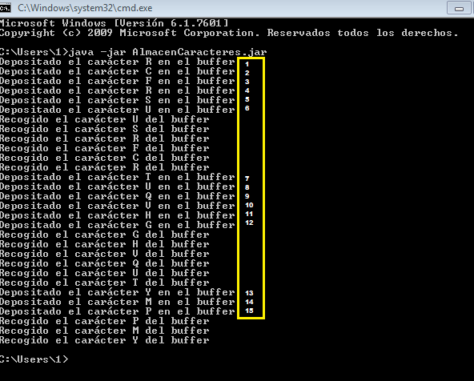

# Generar de forma aleatoria
Aplicación que genera un hilo consumidor y otro productor  

## Instalación 

Windows:

```MOVE origen\AlmacenCaracteres.jar destino\AlmacenCaracteres.jar```  
```MOVE origen\Consumidor.jar destino Consumidor.jar```  
```MOVE origen\Productor.jar destino Productor.jar```  

Linux:

```mv origen/AlmacenCaracteres.jar destino/AlmacenCaracteres.jar```  
```mv origen/Consumidor.jar destino/Consumidor.jar```  
```mv origen/Productor.jar destino/Productor.jar```  

## Ejemplo de generación de los jar
Haciendo click sobre el main, seleccionar Export - Runnable JAR file - Finish

  
  

## Ejemplo de uso   
Abrir la consola de windows  y ubicarse en el lugar de exportación. Ejecutar el jar que contiene el main. 



## Configuración de desarrollo
Requiere instalación de Java 8.

## META
Noelia  ue57656@edu.xunta.es
Distributed under the CreativeCommons by-nc license. See https://creativecommons.org/licenses/by-nc/2.0/es/  for more information.
