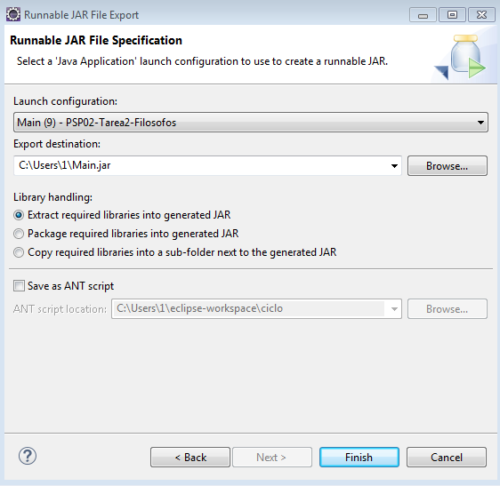
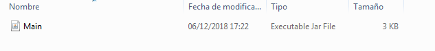
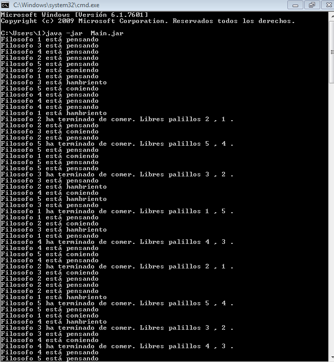
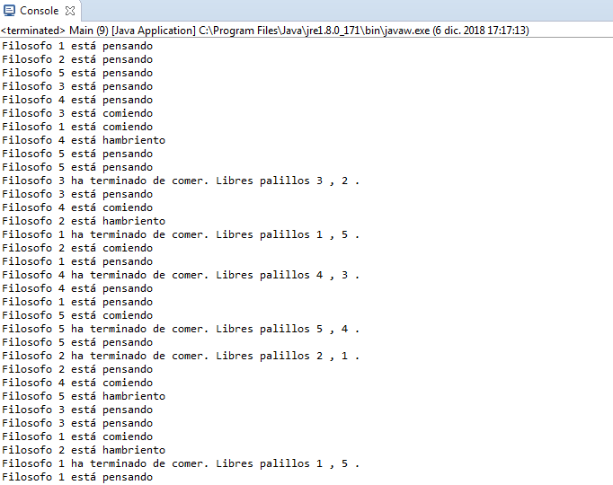

# Generar de forma aleatoria
Aplicación que instancia 5 filósofos que piensan y comen aleatoriamente 

## Instalación 

Windows:

```MOVE origen\Main.jar destino\Main.jar```  


Linux:

```mv origen/Main.jar destino/Main.jar```


## Ejemplo de generación de los jar
Haciendo click sobre el main, seleccionar Export - Runnable JAR file - Finish

  
  

## Ejemplo de uso   
Abrir la consola de windows  y ubicarse en el lugar de exportación. Ejecutar el jar que contiene el main. 




## Configuración de desarrollo
Requiere instalación de Java 8.

## META
Noelia  ue57656@edu.xunta.es
Distributed under the CreativeCommons by-nc license. See https://creativecommons.org/licenses/by-nc/2.0/es/  for more information.
